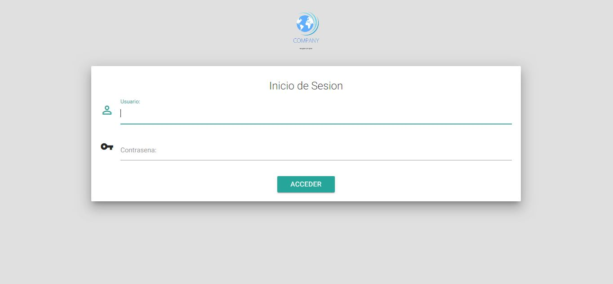
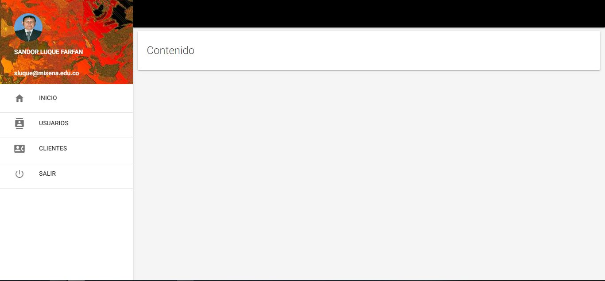
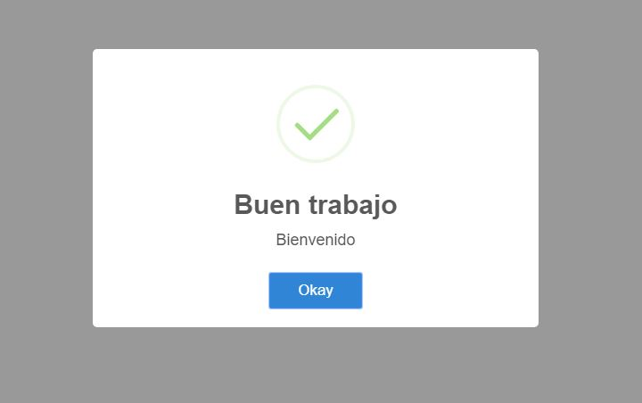
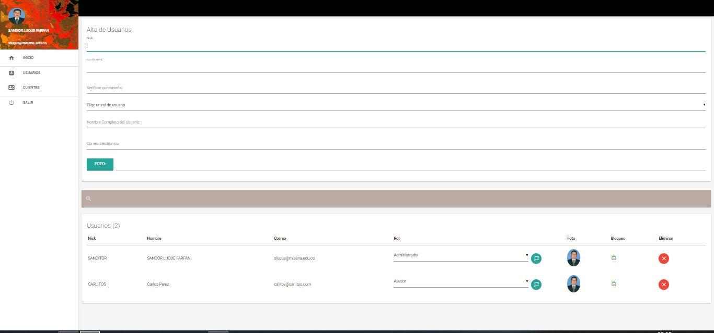
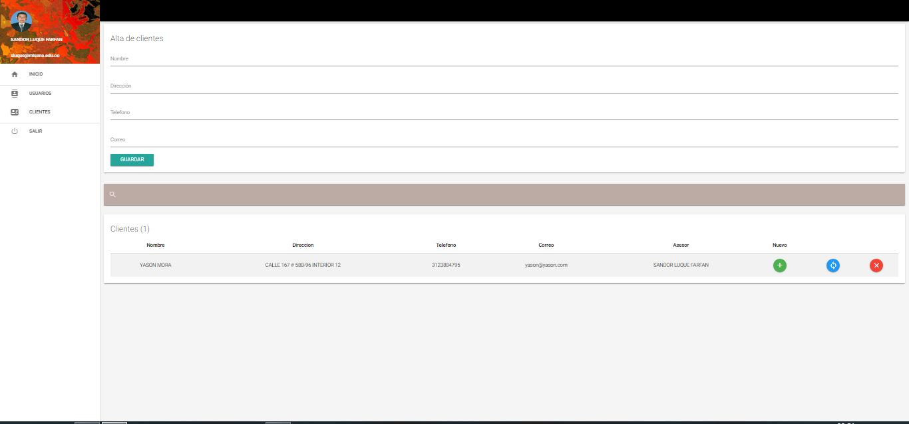
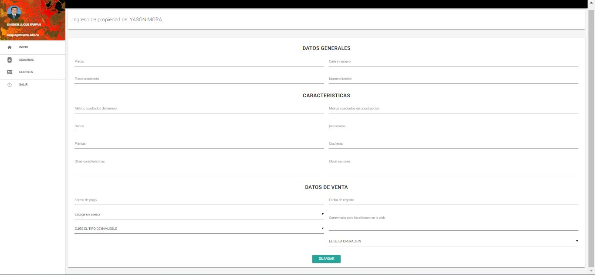

<h1 align="center">Proyecto Inmobiliaria</h1>

## Esta aplicacion es un sistema para gestionar funcionalidades dentro de una inmobiliaria, propgramado en php nativo, materialize, jquery, javascript, mysql. 

##Instrucciones

1. Clonar el repositorio en la carpeta www(wampserver), httdocs(xampp).
2. Ejecutar la sentencia sql(inmobiliaria.sql) que esta dentro de la carpeta de la raiz del proyecto llamada BBDD en phpmyadmin de msql o el ide BBDD preferido.
3. Abir el navegador de su preferencia y teclear en la url: localhost/inmobiliaria
4. iniciar sesion: usuario: sanditor, password: Elshadai&
4. Crear un usuario clientes, editar, cambiar la preferencias, entre otras funcionalidades.

<h3 align="center">Capturas del Aplicativo</h3>

## Previews

      
       
      
      
      
      

 

The PHP software licensed under the [MIT license](https://opensource.org/licenses/MIT).
